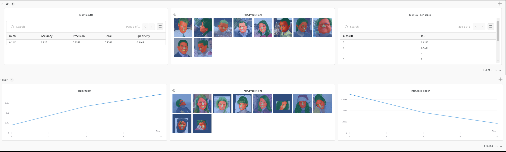

---

<div align="center">

# Sementation Lapa

[](https://www.nature.com/articles/nature14539)
[](https://papers.nips.cc/book/advances-in-neural-information-processing-systems-31-2018)  
[](https://github.com/psf/black)
[](https://github.com/prettier/prettier)

</div>

## Description

This an example project showcasing [Pytorch Lightning](https://www.pytorchlightning.ai/) for training,
[hydra](https://hydra.cc/) for the configuration system and [wandb](https://wandb.ai/) (Weights and Biases) for logging.

The project tackles a more realistic setting than MNIST by demonstrating segmentation of facial regions on the
[LaPa dataset](https://github.com/JDAI-CV/lapa-dataset) with Deeplabv3+.




## Install  

If using Ampere GPUs (RTX 3090), then CUDA 11.1 is required. Some libraries throw error on trying to
install with CUDA 11.0 (unsupported gpu architecture 'compute_86'). This error is solved by moving to
CUDA 11.1.

### Install Pytorch as per CUDA (Feb 2021)

Install Pytorch (`torch` and `torchvision`) before installing the other dependencies.

#### CUDA 11.1

`pytorch` and `torchvision` need to be installed from source. Check:

 - https://github.com/pytorch/pytorch#installation
 - https://github.com/pytorch/vision

 For torchvision, install system dependencies:

 ```shell script
sudo apt install libturbojpeg libpng-dev libjpeg-dev
```

#### CUDA 11.0

Systems with Cuda 11.0 (such as those with Ampere GPUs):

```shell script
pip install -r requirements-cuda11_0.txt
```

#### CUDA 10.x

System with CUDA 10.x:

```shell script
pip install -r requirements-cuda10.txt
```

### Install project package and dependencies

```shell script
# clone project
git clone git@github.com:Shreeyak/pytorch-lightning-segmentation-lapa.git

# install project in development mode
cd pytorch-lightning-segmentation-lapa
pip install -e .

# Setup git precommits
pip install -r requirements-dev.txt
pre-commit install
```

#### Developer dependencies

This repository uses git pre-commit hooks to auto-format code.
These developer dependencies are in requirements-dev.txt.
The other files describing pre-commit hooks are: `pyproject.toml`, `.pre-commit-config.yaml`

## Usage

Download the Lapa dataset from https://github.com/JDAI-CV/lapa-dataset  
It can be placed at `seg_lapa/data`.

Run training. See the [hydra documentation](https://hydra.cc/docs/advanced/override_grammar/basic)
on how to override the config values from the CLI.

```bash
# Run training
python -m seg_lapa.train dataset.data_dir=<path_to_data>

# Run on multiple gpus
python -m seg_lapa.train dataset.data_dir=<path_to_data> train.gpus=\"0,1\"
```

## Using this template for your own project

To use this template for your own project:

1. Search and replace `seg_lapa` with your project name
2. Edit setup.py with new package name, requirements and other details
3. Replace the model, dataloaders, loss function, metric with your own!
4. Update the readme! Add your own links to your paper at the top, add citation info at bottom.

This template was based on the Pytorch-Lightning
[seed project](https://github.com/PyTorchLightning/deep-learning-project-template).

### Callbacks

The callbacks can be configured from the config files or
[command line overrides](https://hydra.cc/docs/next/advanced/override_grammar/basic/).
To disable a config, simply remove them from the config. More callbacks can easily be added to the config system
as needed. The following callbacks are added as of now:

- [Early Stopping](https://pytorch-lightning.readthedocs.io/en/latest/generated/pytorch_lightning.callbacks.EarlyStopping.html#pytorch_lightning.callbacks.EarlyStopping)
- [Model Checkpoint](https://pytorch-lightning.readthedocs.io/en/latest/generated/pytorch_lightning.callbacks.ModelCheckpoint.html#pytorch_lightning.callbacks.ModelCheckpoint)
- [Log Media](#logmedia)

CLI override Examples:

```shell script
# Disable the LogMedia callback.
python -m seg_lapa.train "~callbacks.log_media"

# Set the EarlyStopping callback to wait for 20 epochs before terminating.
python -m seg_lapa.train callbacks.early_stopping.patience=20
```

#### LogMedia

The LogMedia callback is used to log media, such as images and point clouds, to the logger and to local disk.
It is also used to save the config files for each run. The `LightningModule` adds data to a queue, which is
fetched within the `LogMedia` callback and logged to the logger and/or disk.

To customize this callback for your application, override or modify the following methods:

- `LogMedia._get_preds_from_lightningmodule()`
- `LogMedia.__save_media_to_disk()`
- `LogMedia.__save_media_to_logger()`
- The LightningModule should have an attribute of type `LogMediaQueue` called `self.log_media`.
  Change the data that you push into the queue in train/val/test steps as per requirement.

##### Notes:

- LogMedia currently supports the Weights and Biases logger only.
- By default, LogMedia only saves the latest samples to disk. To save the results from each step/epoch, pass
  `save_latest_only=False`.

#### EarlyStopping

This is Lightning's built-in callback. Here's some tips on how to configure early stopping:

```
Args:
        monitor: Monitor a key validation metric (eg: mIoU). Monitoring loss is not a good idea as it is an unreliable
                 indicator of model performance. Two models might have the same loss but different performance
                 or the loss might start increasing, even though performance does not decrease.

        min_delta: Project-dependent - choose a value for your metric below which you'd consider the improvement
                   negligible.
                   Example: For segmentation, I do not care for improvements less than 0.05% IoU in general.
                            But in kaggle competitions, even 0.01% would matter.

        patience: Patience is the number of val epochs to wait for to see an improvement. It is affected by the
                  ``check_val_every_n_epoch`` and ``val_check_interval`` params to the PL Trainer.

                  Takes experimentation to figure out appropriate patience for your project. Train the model
                  once without early stopping and see how long it takes to converge on a given dataset.
                  Choose the number of epochs between when you feel it's started to converge and after you're
                  sure the model has converged. Reduce the patience if you see the model continues to train for too long.
```

#### ModelCheckpoint

This is also Lightning's built-in callback to save checkpoints. It can monitor a logged value and save best checkpoints,
save the latest checkpoint or save checkpoints every N steps/epoch.  
We save checkpoints in our own logs directory structure, which is different from Lightning's default.

### Loggers

At this point, this project only supports the WandB logger (Weights and Biases). Other loggers can easily be added.  
Modify these methods after adding your logger to the config system:

- `utils.generate_log_dir_path()` - Generates dir structure to save logs
- `LogMedia._log_images_to_wandb()` - If logging media such as images

### Notes

#### Pre-commit workflow

The project uses pre-commit hooks for `black` and `prettier`, which are auto-format tools for `.py` and
`.yaml | .md` files respectively. After pushing code to a branch, the formatter will automatically run
and apply changes to submitted code.

#### Absolute imports

This project is setup as a package. One of the advantages of setting it up as a
package is that it is easy to import modules from anywhere.
To avoid errors with pytorch-lightning, always use absolute imports:

```python
from seg_lapa.loss_func import CrossEntropy2D
from seg_lapa import metrics
import seg_lapa.metrics as metrics
```

### Citation

```
@article{YourName,
  title={Your Title},
  author={Your team},
  journal={Location},
  year={Year}
}
```
